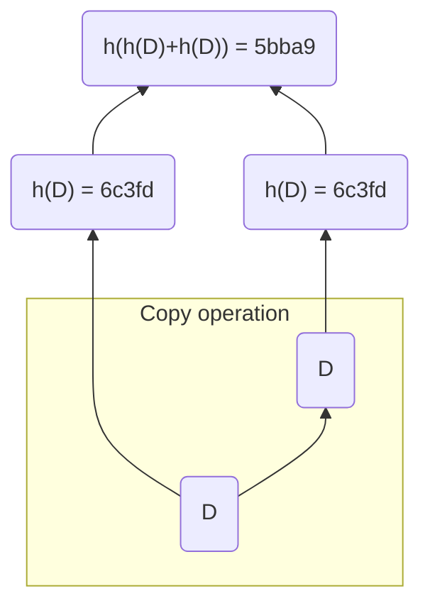

# MerkleTree Written in Rust

## What?

This project involves creating a Merkle Tree from a `Vec<String>`, utilizing `crypto::sha3::Sha3::keccak256()` as the hash function.

In the initial implementation, the aim is to maintain the leaves of all levels as `MerkleTreeDs` (MerkleTreeDataStructure). The `new` operation is straightforward. However, adding or pushing a new leaf and verifying if an element exists in the Merkle tree given the "path" require a more sophisticated algorithm ([Merkle Patricia Trie](https://ethereum.org/en/developers/docs/data-structures-and-encoding/patricia-merkle-trie)).

To simplify the data structure, instead of using an arrangement based on `Option<Box<Node>>`—where each node contains an item along with left and right nodes—we propose employing a `Vec<String>` to store the initial leaves. The resulting `MerkleTreeVec` structure only holds the initial leaves and the root. One drawback is that recalculating the root needs to be recomputed entirely if a new leaf is added or pushed.

## Why?

The main goal of the project is to practice Rust Programming, understand the MerkleTree data structure and know its potential.

An issue that may arise is the need to recalculate the entire tree when a leaf is added. However, this is a tradeoff between memory usage, which would be required to store all the hashes in memory, and the algorithm's efficiency. By only storing the initial leaves and the root, memory requirements are reduced by half compared to an implementation that stores all the leaf hashes up to the root. Additionally, the use of a Vec illustrates the concept of the Merkle Tree in a straightforward manner.

## How?

```sh
cargo run 
```

### Simple usecase

`main.rs`:

```rust
mod merkle_tree;
mod merkle_tree_vec;

use crate::merkle_tree::MerkleTreeDs;
use crate::merkle_tree_vec::{keccak256, MerkleTreeVec};

fn main() -> Result<(), String> {
    let mtree = MerkleTreeDs::new(vec_to_string!["D"]);
    let mtree_vec = MerkleTreeVec::new(&slice_to_string!["D"], &keccak256);

    let d_proof = mtree_vec.get_proof("D")?;

    for (i, x) in d_proof.iter().enumerate() {
        println!("proof of D[{i}]: {}", x);
    }
    let verify = mtree_vec.verify(d_proof, "D");

    println!("Is the proof of D right? {}", verify.unwrap());
    println!("{mtree}");
    println!("{}", mtree_vec.root);
    Ok(())
}
```

Output:

```sh
proof of D[0]: 6c3fd336b49dcb1c57dd4fbeaf5f898320b0da06a5ef64e798c6497600bb79f2
Is the proof of D right? true
Merkle Tree:
root-5bba9
    └──>left-6c3fd
        └──>left-None
        └──>right-None
    └──>right-6c3fd
        └──>left-None
        └──>right-None

5bba9e0117f3f6f939a3279d74fbde5ef35562de16f4f6f0c01295ca838d39dd
```

Here `"D"` is duplicated and we get the following:



Explanation generated by ChatGPT:

```
In the context of a Merkle Tree, duplicating a value when needed typically occurs during tree balancing. When a new leaf is added to the tree and it needs to be hashed with another value to maintain the binary tree structure, but there is no corresponding value to hash with, the existing value is duplicated to serve as the missing hash partner.

Here's how this expansion works in the context of a Merkle Tree:

1. **Balancing the Tree**: When adding a new leaf to the Merkle Tree, it's crucial to maintain a binary tree structure. If the number of leaves is odd, the last leaf needs to be duplicated to maintain balance. This ensures that each leaf has a partner to hash with at each level of the tree.

2. **Hashing Pairs**: In a Merkle Tree, each level consists of hashed pairs of values. When balancing the tree requires duplicating a leaf, the duplicated leaf is used as a hash partner for the original leaf at that level. This duplication ensures that the tree remains balanced and each node has two children.

3. **Recalculating Root Hash**: When duplicating a leaf, it affects the hashes all the way up to the root of the tree. After duplicating a leaf, the hashes along the path from the leaf to the root need to be recalculated to reflect the change in the tree structure.

4. **Maintaining Consistency**: Duplicating a leaf ensures consistency in the Merkle Tree structure and enables efficient verification of the integrity of data. Each leaf still represents the same original value, but the duplication facilitates proper tree balancing and hash computation.

In summary, duplicating a value in a Merkle Tree ensures that the tree remains balanced and maintains its integrity, even when additional leaves are added or removed. This duplication strategy is essential for maintaining the structural integrity and security properties of Merkle Trees.
```

### Useful Resources: 

- [Merkle Tree Construction and Proof-of-Inclusion](https://www.derpturkey.com/merkle-tree-construction-and-proof-of-inclusion/)
- [Solidity: Merkle Trees, BitMaps & Coding an Airdrop - YouTube](https://www.youtube.com/watch?v=Iv0cPT-7AR8)
- [Learn Solidity (0.5) - Merkle Tree - YouTube](https://www.youtube.com/watch?v=n6nEPaE7KZ8)
- [Using Merkle Trees for Smart Contracts | by mbvissers.eth | CodeX | Medium](https://medium.com/codex/using-merkle-trees-for-smart-contracts-24ccf6f75a0a)
