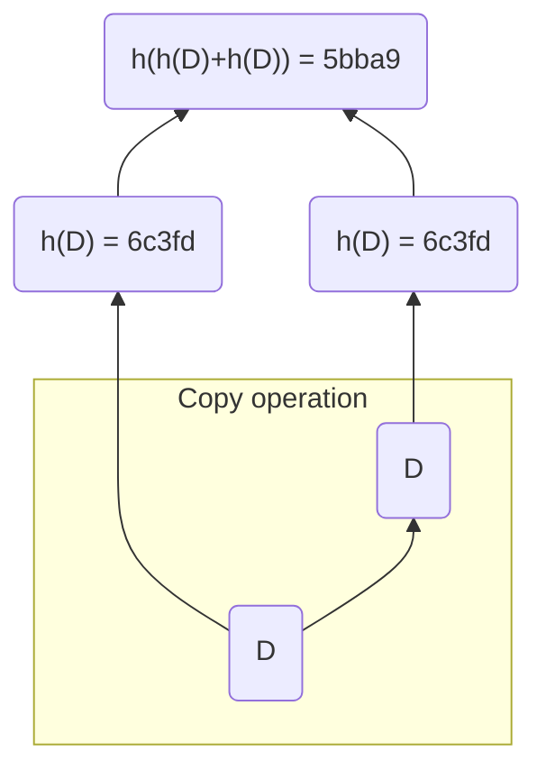

# MerkleTree Written in Rust (WIP)

## What?

This is a simple project that creates a simple MerkleTree out of a `Vec<String>`. `crypto::sha3::Sha3::keccak256()` is used as the hash function.

## Why?

The main goal of the project is to practice Rust Programming, understand the MerkleTree data structure and know its potential.

## How?

```sh
cargo run 
```

### Simple usecase

`main.rs`:

```rust
fn main() {
    let mtree = MerkleTree::new(vec!["D".to_string()]);

    println!("{mtree}");
}
```

Output:

```sh
Merkle Tree:
 root- 5bba9
     left- 6c3fd
        left- None
        right- None
     right- 6c3fd
        left- None
        right- None
```

Here `"D"` is duplicated and we get the following:


